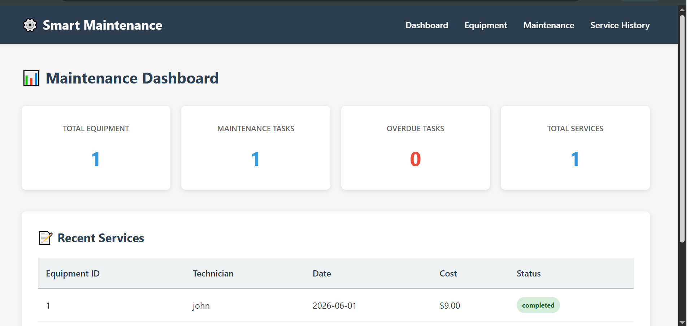
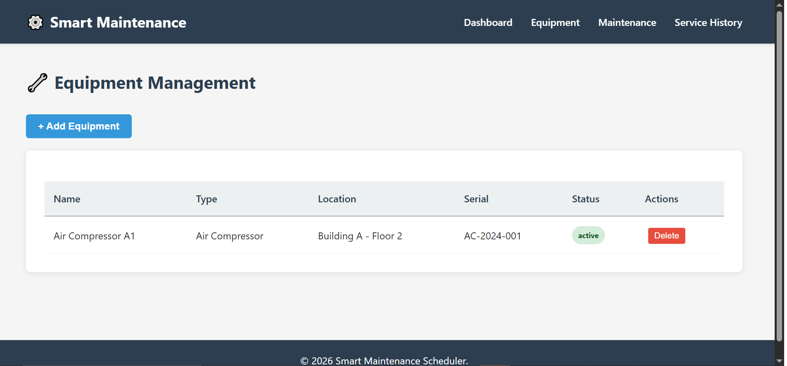
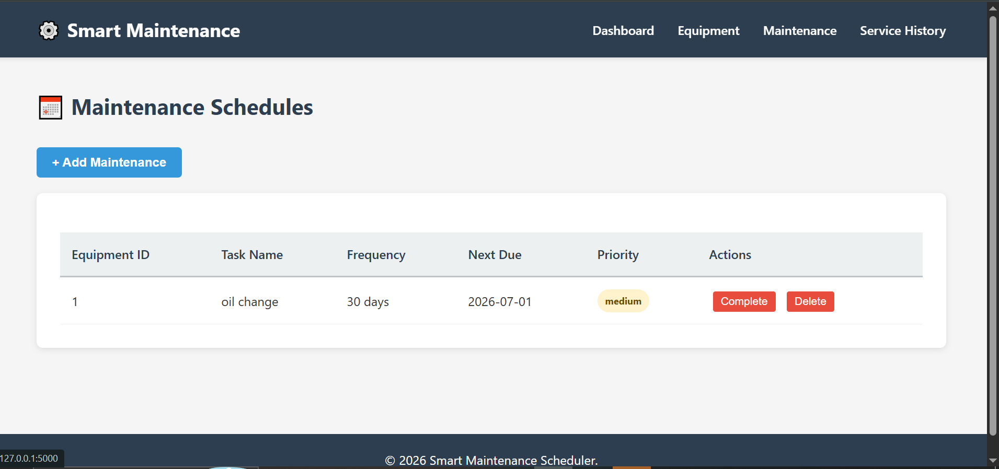
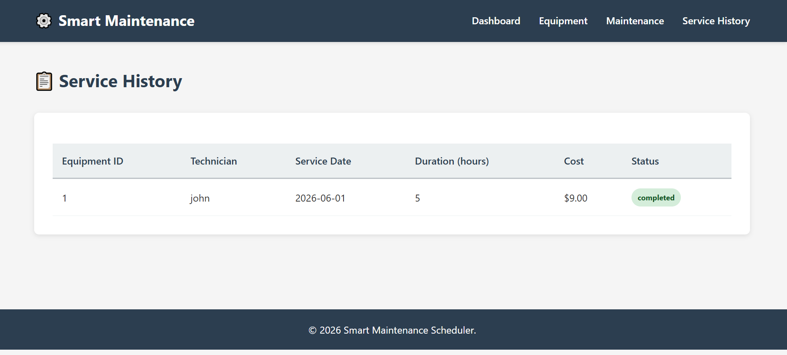

# Smart Maintenance Scheduler

A web application to track equipment and manage maintenance schedules.

## Features

-  Equipment Management - Add, track, and manage equipment
-  Maintenance Scheduling - Automated due date calculations  
-  Service History - Complete records of all work done
-  Dashboard - View stats and recent services
-  Professional UI - Clean, easy-to-use interface

## Technology Stack

- **Backend:** Python, Flask
- **Database:** SQLite, SQLAlchemy
- **Frontend:** HTML, CSS, JavaScript

## How to Install

### Step 1: Clone the Repository
```bash
git clone https://github.com/MehakImran-1/smart-maintenance-scheduler.git
cd smart-maintenance-scheduler
```

### Step 2: Create Virtual Environment
```bash
python -m venv myenv
myenv\Scripts\activate  # Windows
# or
source myenv/bin/activate  # Mac/Linux
```

### Step 3: Install Dependencies
```bash
pip install -r requirements.txt
```

### Step 4: Run the Application
```bash
python app.py
```

### Step 5: Open in Browser
http://localhost:5000

## Requirements

- Python 3.8 or higher
- pip (Python package manager)
- Modern web browser
  
## Preview

### Dashboard


### Equipmments


### Maintenance


### Service history
 

---

## About the Developer

**Mehak Imran**  
Bachelor of Science in Information Engineering Technology (BSIET)

GitHub: https://github.com/MehakImran-1  
Email: 70147062@student.uol.edu.pk
